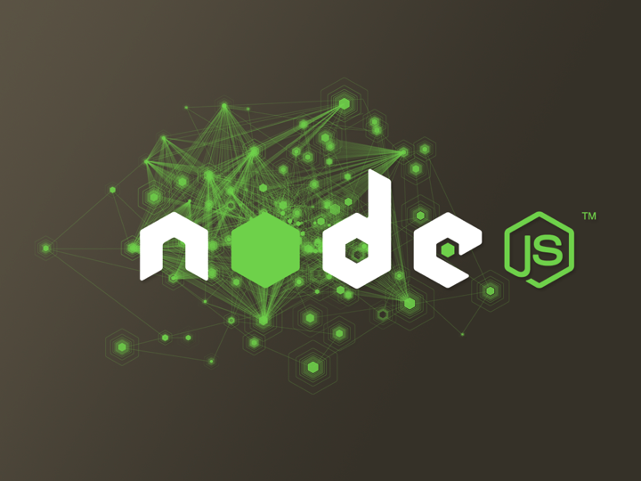
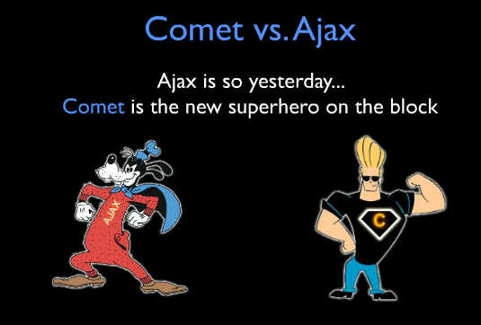
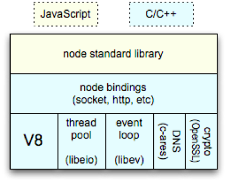
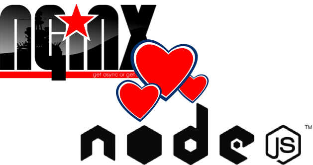
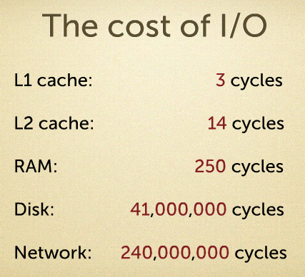
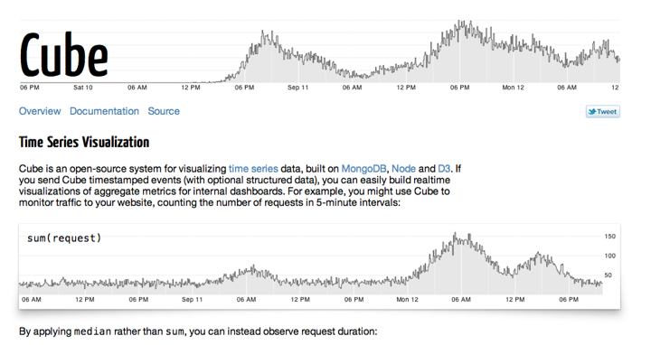
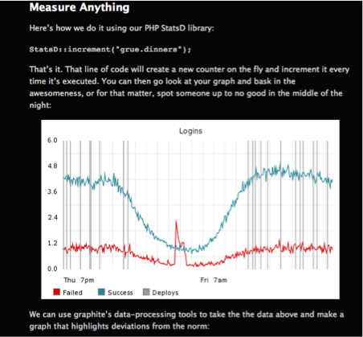

.. include:: <s5defs.txt>

==============================
JavaScript, the Functional Way
==============================

:Author:  Andrew Montalenti
:Date:    $Date: 2011-10-23 09:00:00 -0500 (Tues, 23 Oct) $

.. This document is copyright Andrew Montalenti and Parsely, Inc.

.. container:: handout

    **How this was made**

    This document was created using Docutils_/reStructuredText_ and S5_.

    This presentation has been used as an introduction to JavaScript for existing
    programmers, but is also an exploration of what makes the JavaScript language
    good and not so good. I have used it to bring skilled backend programmers (Python,
    Java, C) up-to-speed on the latest thinking in the JS community. It also includes
    some materials about Node.JS, since Node has provided a great environment for writing
    production-quality JavaScript code in a non-browser context.

    Simplicity begets elegance.

.. _Docutils: http://docutils.sourceforge.net/
.. _reStructuredText: http://docutils.sourceforge.net/rst.html
.. _S5: http://meyerweb.com/eric/tools/s5/

Meta Information
----------------

**Me**: I've been using JavaScript for 10 years. I primarily use Python and JavaScript full-time, and have for the last 3 years. I'm the founder/principal at `Aleph Point`_, an agile software engineering consulting and training firm. I'm co-founder/CTO of Parse.ly_, a tech startup in the digital media space.

**E-mail me**: andrew@parsely.com

**Follow me on Twitter**: amontalenti_

**Connect on LinkedIn**: http://linkedin.com/in/andrewmontalenti

.. _Aleph Point: http://alephpoint.com
.. _Parse.ly: http://parsely.com
.. _amontalenti: http://twitter.com/amontalenti

Baby Turtles
------------

Use your powers wisely, and always remember...

.. image:: img/babyturtles.png
    :align: center

Magic Turtles!
--------------

It's turtles all the way down!

.. image:: img/magicturtle.jpg
    :align: center

Writing Real Programs... with JavaScript!?
------------------------------------------

This was the original name of this talk.

The "!?" was because, when I was starting out in programming, no one considered JavaScript
a "real" programming language. The truth is, though, that people had the same feelings
toward Python back then, and how wrong they were.

I have come to realize in the last 2 years that JavaScript is, quite simply, the most
important programming language to know right now. Ignore and deride it at your own peril.

The Beast with Two Backs
------------------------

JS is a cool programming language!

.. class:: incremental

        * Functional
        * Weakly and dynamically typed
        * Function scope and closure
        * Has a >99% desktop install base (no kidding!)

JS is not a real programming language!

.. class:: incremental

        * No compilation units, modules and namespaces
        * No classes or object-orientation built-in
        * No standard library (no kidding!)
        * Incoherent implementation standard

JS boring details in one slide
------------------------------

.. class:: incremental

        Number: double-precision 64-bit IEEE 754, e.g. 0 or 0.5
        String: stream of 16-bit Unicode characters, e.g. “hello, world!”
        Boolean: true or false
        object: {a: b} - like Python dictionary + attribute (dot notation) syntax
                Function: function() {}
                Array: [a, b] – implemented as hash, includes length property
                Date: supports basic date/time representation and parsing from strings
                RegExp: created using /regex/ syntax; efficient RegEx impl
        Null: null - deliberate non-value
        Undefined: undefined  - uninitialized value

.. class:: small

        no I/O – object literals – common C-style if, for, switch/case, while statements – uncommon C-style do/while, tertiary statement, and short-circuiting – var keyword – string concatenation and splicing – prototype chain – toString – type coercion – truthy and falsy – triple-equals (===) vs. double-equals (==) – typeof (broken!)

What makes JavaScript cool?
---------------------------

Like Python, JavaScript is a small language. It fits in your head.

Like Python, JavaScript is multi-paradigm, but has even more support for functional
programming than Python.

JavaScript's functional core allows you to build powerful primitives easily, but unlike
Python, batteries are not included.

Our first example
-----------------

Our first example is a map/reduce implementation written with JS functions.

.. class:: incremental

        we build an iterator function called each which is found in most JS frameworks
        we implement map and reduce using each
        we implement a test function that maps pow2 function (x*x) to each element in a list, and then reduces it via addition.

End result is equivalent to the following Python: sum(x*x for x in items)

The iterator function: each
---------------------------

.. sourcecode:: javascript

        function each(items, fn) {
                for (var i = 0; i < items.length; i++) {
                        var item = items[i];
                        fn.apply(item, []);
                }
        };

Iterate and apply a function: map
---------------------------------

.. sourcecode:: javascript

        function map(items, fn) {
          var results = [];
          each(items, function() {
            var val = fn.apply(this, [this]);
            results.push(val)
          }); 
          return results;
        };

Iterate and collapse values into one: reduce
--------------------------------------------

.. sourcecode:: javascript

        function reduce(items, fn) {
          var result;
          var first = true;
          var that = this;
          each(items, function() {
            if (first) {
              result = this;
              first = false;
              return; // continues
            }
            result = fn.apply(that, [result, this]);
          });
          return result;
        };

Test case for our functional primitives
---------------------------------------

.. sourcecode:: javascript

        function test_map_reduce() {
          var adder = function(i1, i2) { return i1 + i2; };
          var pow2 = function(i) { return i * i; };
          var input = [1, 2, 3, 4, 5, 6];
          console.log("input: " + input);
          var mapped = map(pow2, input);
          console.log("mapped: " + mapped);
          var reduced = reduce(mapped, adder);
          console.log("reduced: " + reduced);
        };

Run it! It works!
-----------------

.. sourcecode:: javascript

        >>> test_map_reduce();
        input: 1,2,3,4,5,6
        mapped: 1,4,9,16,25,36
        reduced: 91

Grokking functional JS
----------------------

.. class:: incremental

        Functions are first-class objects, but they have some quirks.

        Three declaration forms: 

        function statements
        anonymous function expressions
        named function expressions (exotic)

        The keyword this is used for functional calling context, controlled by fn.apply()

Declaration forms
-----------------

.. sourcecode:: javascript

        function add1(i1, i2) {
          return i1 + i2;
        }

        var add2 = function(i1, i2) {
          return i1 + i2;
        }

        var add3 = function add3(i1, i2) {
          return i1 + i2;
        }
        
Calling context
---------------

.. sourcecode:: javascript

        function each(items, fn) {
          for (var i = 0; i < items.length; i++) {
            var item = items[i];
            fn.apply(item, []);
          }
        }
        each([0, 1], function() { console.log(this); }); 

IMAGE NECESSARY FOR THIS ONE

Closure is obvious and complex
------------------------------

.. class:: incremental

        Because JavaScript can treat function definitions as expressions, they can be used almost
        anywhere in your program.

        Common locations:

        Nested within other functions
        As values in object literals
        As arguments to other functions

        Closure allows functions to access the values of variables outside the scope of the 
        function definition, even after that variable has gone out of scope.

Common function locations
-------------------------

.. sourcecode:: javascript

        function nestedArgument() {
          var arr = [];
          each(results, function() {
            // do something with arr
          });
        }

        function objLiteral() {
          var obj = {};
          return {
            "do": function() { }
          };
        }

Closure
-------

.. sourcecode:: javascript

        function map(fn, items) {
          var results = [];
          each(items, function() {
            var val = fn.apply(this, []);
            results.push(val)
          }); 
          return results;
        }

NEEDS AN IMAGE.

Closure stack
-------------

.. sourcecode:: javascript

        function stack() {
          var stack = [];
          var pusher = function(item) {
            stack.push(item);
          };
          var popper = function() {
            return stack.pop();
          };
          var peeker = function() {
            return stack[stack.length-1];
          }
          var obj = { "push": pusher, "pop": popper, 
                      "peek": peeker };
          return obj; // upon return, stack not in scope
        }

OO JS?
------

.. sourcecode:: javascript

        >>> var s = stack()
        Object
        >>> s.push(0)
        >>> s.peek()
        0
        >>> s.peek()
        0
        >>> s.push(1)
        >>> s.peek()
        1
        >>> s.pop()
        1
        >>> s.pop()
        0
        >>> s.pop()
        >>> s.pop()

Closure Book
------------

IMAGE.

What hath we wroought?
----------------------

CROCKFORD IMAGE.

JavaScript OO vs. Java OO
-------------------------

“Java is to JavaScript what
      Car is to Carpet.”
- Chris Heilmann

Classical stack
---------------

.. sourcecode:: javascript

        function Stack() {
          var stack = [];
          this.push = function(item) {
            stack.push(item);
          };
          this.pop = function() {
            return stack.pop();
          };
          this.peek = function() {
            return stack[stack.length-1];
          };
        };

Classical stack, explained
--------------------------

.. class:: incremental

    The Stack() function acts as both a local namespace for private data, and an initialization function (aka constructor). 

    The calling context (this keyword) provides the object in which public instance data can be stored.

Classical stack, improved
-------------------------

.. sourcecode:: javascript

        var Stack = function() {
          this.stack = [];
        };
        Stack.prototype.push = function(item) {
            this.stack.push(item);
        };
        Stack.prototype.pop = function() {
            return this.stack.pop();
        };
        Stack.prototype.peek = function() {
            return this.stack[stack.length-1];
        };

Improved version, explained
---------------------------

.. class:: incremental
   
    Stack() function still acts as a constructor.

    Stack.prototype acts like a "Class" type would in other language, provides properties and functions that can be shared by all "instances" of a Stack.

    Private data must be stored in a new, outer namespace, accessible by closure.

Objects and calling context
---------------------------

.. sourcecode:: javascript

    var obj = {
        callMethod: function() { console.log(this); }
    };
    >>> obj.callMethod()
    { callMethod: [Function] }
    >>> var fn = obj.callMethod;
    >>> fn()
    {}
    >>> [obj.callMethod][0]()
    [ [Function] ]

WTF is going on!?!

Every function call is a call to .apply()
-----------------------------------------

.. sourcecode:: javascript

    obj.callMethod() === obj.callMethod.apply(obj, [])
    var fn = obj.callMethod; fn() === obj.callMethod.apply(global, [])
    [obj.callMethod][0]() === obj.callMethod.apply([obj.callMethod], [])

Get it?

The new keyword
---------------

.. sourcecode:: javascript

        >>> var s = new Stack()
        Object
        >>> s.push(0)
        >>> s.peek()
        0
        >>> s.peek()
        0
        >>> s.push(1)
        >>> s.peek()
        1
        >>> s.pop()
        1
        >>> s.pop()
        0
        >>> s.pop()
        >>> s.pop()

What the heck is the "new" keyword doing?

The new keyword, explained
--------------------------

.. sourcecode:: javascript

        >>> var s = {};
        >>> Stack.apply(s, []);
        >>> s.peek()
        0
        >>> s.peek()
        0
        >>> s.push(1)
        >>> s.peek()
        1
        >>> s.pop()
        1
        >>> s.pop()
        0
        >>> s.pop()
        >>> s.pop()

Yep, that's all.

Spot the bug
------------

.. sourcecode:: javascript

        >>> var s = Stack();
        >>> s.push(0);
        TypeError: s is undefined 
        . . . source=with(_FirebugCommandLine)
        . . . {s.push(0)\n};
        >>> window.push(0);
        >>> window.pop();
        0

Ugh, how annoying. We just installed some methods in window!

Now, for the bad parts
----------------------

.. class:: incremental

        In JavaScript, variables are global by default.
        The keyword this is bound to “the global object” by default, which in browsers is usually window.
        Since functions meant to be used with the new keyword can be called without the new keyword, functions that rely on  new/this for OO programming are often accidentally misused.
        Since this changes based on calling context AND “normal” fn() invocation does not alter calling context, this is a regular source of bugs.

What can we do?
---------------

.. class:: incremental

        Define only a SINGLE GLOBAL for your application, which acts as a namespace
        Be highly COGNIZANT OF this, and DOCUMENT when you rely on it
        Name all functions meant to be used with new with CamelCase, e.g. Stack
        Use the MODULE PATTERN and CLOSURE to organize your code
        Follow OO patterns and use a FRAMEWORK
        Use jslint / jshint to check our source code

Module pattern
--------------

.. sourcecode:: javascript

        var NS = function () { // create namespace
          // private module data
          var VERSION = “1.2”;

          // public module classes, functions, and variables
          var m = {}; 
          m.DateParser = function() {
            this.parse = function() {};
          };
          m.parseDate = function(s) {
            var dp = new m.DateParser();
            return dp.parse(s);
          };
          return m;
        }(); // invoke function to hide private data

Follow this pattern, and you can have Python-style modules, with functions and classes!

Using a module
--------------

.. sourcecode:: javascript

        >>> NS.parseDate(“2009-09-01”);
        DateParser(year=2009, month=09, day=01)
        >>> new NS.DateParser().parse(“2009-09-01”);
        DateParser(year=2009, month=09, day=01)

No standard library, though
---------------------------

.. class:: incremental

        JavaScript desperately needs a standard library
        Heavy development is underway to achieve this:
                chironjs / narwhal
                CommonJS
                ECMAScript standard
                For server-side, Node.JS

My pragmatic clientside stack
-----------------------------

.. class:: incremental

        These are libraries I use every day for real programming with JS:
        jQuery: CSS-style DOM selector, animations, event binding, HTTP requests
        Sometimes, ExtJS: Observable, ISO8601 DateTime, OO, XTemplate, Store, DomHelper, JSON, Forms, TaskRunner, and a slew of extensible UI components
        Underscore.js: functional primitives
        DateJS: extended date parsing and manipulation
        BlackbirdJS: cross-browser client-side logging
        Bootstrap (new!): standard UI components for HTML5

My pragmatic dev env for JS
---------------------------

.. class:: incremental

    These are the tools I use on a daily basis for doing JS prototyping and development:
        Firebug
        Live HTTP Headers
        Webstorm
        node, especially node-static

Act I, Fin
----------

This ends our look at the JavaScript language. Now, on to Node.JS.

Node.JS
-------

Why Server-Side JS?
-------------------

The Grand Unified Stack: JavaScript front to back, baby.

The rise of Rich Internet Applications (RIAs) has led to a smaller role for servers anyway.

Re-use between client/server (e.g. form validation logic, utilities, object models) may de-duplicate code

Single syntax may reduce programmer context switching

Why has SSJS failed so far?
---------------------------

Netscape LiveWire
    * Tied to a commercial vendor
    * JavaScript was not even adopted yet

Rhino
    * Open source
    * No community (identity crisis)
    * Poor performance
    * JavaScript was not cool yet

Node.JS: right place, right time
--------------------------------

And, the right tool.

.. class:: incremental

    * Open source
    * A library to build HTTP servers
    * Riding asynchronous wave (epoll)
    * Riding realtime wave (COMET, Websockets)
    * A strong community of professional JS hackers

JavaScript has finally been made cool, thanks to AJAX/RIAs, and now Node.JS.

Revenge of JS
-------------

"Despite JavaScript's astonishing shortcomings, deep down, in its core, it got something
very right.  JavaScript was the world's most misunderstood programming language. 

Its obvious defects, its unfashionable programming model, intentional mispositioning at
its introduction, and its ridiculous name caused it to be rejected as unworthy by most
knowledgeable programmers. But Ajax gave JavaScript a second chance....

It's better to be lucky
-----------------------

... Because JavaScript is the language of the web browser, and because the web browser has
become the dominant application delivery system, and because JavaScript isn't too bad,
JavaScript has become the World's Most Popular Programming Language. Its popularity is
growing. It is now being embedded in other applications and contexts. JavaScript has
become important.

It is better to be lucky than smart.”

- Douglas Crockford

Does coolness matter?
---------------------

Yes, because many programmers are superficial.

What Node.JS isn't
------------------

!== Django/Rails

Pieces of Django/Rails are implemented by npm modules, but no unified web stack yet

!== Rhino/Spidermonkey

Node.JS is one layer up from these (think Python/Ruby standard library, not the interpreter itself).

(But, Node.JS uses a different interpreter, too.)

What Node.JS is
---------------

A standard library for JavaScript... though still minimal.

An asynchronous server library (epoll, ala Twisted, Tornado, EventMachine)

Because programmable async servers were the reason Node.JS was written, its standard
library has an async bent.

Node.JS Architecture
--------------------

OK, but what is Node.JS, really?
--------------------------------

It’s clear devs want it to become as powerful as Django/Rails for web app development

.. class:: incremental

        express module is starting to provide routing and controllers
        mongodb and redis are popular data stores for Node
        template languages are ported every day 

The promise
-----------

Maybe Node.JS can simplify the web stack.

.. class:: incremental

        Simplify the backend with JSON-based, async write/read data stores
        Simplify the middle tier with clientside / serverside code sharing.
        Simplify the frontend, with server-backed data bindings
        Simplify deployment, since Node.JS runs directly in production.

Intro to epoll: 10k problem
---------------------------

.. image:: 10k-problem.png
    :align: center

Nginx vs. Apache
----------------

.. image:: nginx-vs-apache.png
    :align: center

Nginx and Node
--------------

I/O costs
---------

Intro to Node.JS coding
-----------------------

Now that we understand why Node.JS is important, let's take a look at some examples of
creating Node.JS HTTP servers.

HTTP Hello, World
-----------------

.. sourcecode:: javascript

        var http = require('http');
        var server = http.createServer(function(req, rsp) {
            rsp.writeHead(200, {"Content-Type": "text/plain"});
            rsp.end("Hello World\n");
        });
        server.listen(8000);
        console.log("Server running at :8000");

Express Hello, World
--------------------

.. sourcecode:: javascript

        var app = require('express').createServer()

        app.get('/', function(req, rsp) {
            rsp.writeHead(200, {"Content-Type": "text/plain"});
            rsp.end("Hello World\n");
        });
        app.listen(8000);
        console.log("Server running at :8000");

UNIX Hello, World
-----------------

.. sourcecode:: javascript

        var fs = require('fs');
        var lazy = require('lazy');
        lazy(fs.createReadStream("/usr/share/dict/words"))
            .lines
            .forEach(function(line) {
                var line = line.toString();
                if (line.indexOf("hello") !== -1 
                   || line.indexOf("world") !== -1) {
                    console.log(line);
                }
            });

Client/Server Hello, World
--------------------------

.. sourcecode:: javascript

        var 
        html = require('fs’).readFileSync(…),
        srv = require('http’).createServer(function(req, res){
          res.end(html);
        });
        server.listen(8080);

        var nowjs = require("now");
        var everyone = nowjs.initialize(server);

        everyone.now.distributeMessage = function(message){
          everyone.now.receiveMessage(this.now.name, message);
        };

Client/Server Hello, World
--------------------------

.. sourcecode:: javascript

        $(function() {
          now.receiveMessage = function(name, message) {
            $("#messages")
            .append(" " + name + ": " + message);
          };
          $("#send-button").click(function() {
            now.distributeMessage("Hello, world");
          });
          now.name = prompt("What's your name?", "");
        });

Notice a trend?
---------------

.. class:: incremental

        Node.JS relies heavily on what you might call the Hollywood Principle
        "Don’t call us, we’ll call you"
        Node.JS achieves this through a heavy use of callbacks and errbacks
        Luckily, we now know Functional JS!

Why callbacks?
--------------

.. class:: incremental

        In Node.JS, everything runs in parallel, except your code.
        Let's say you register two callbacks in Express.
        Node.JS registers those callbacks, and goes to sleep.
        Request comes in, dispatches it to callback – meanwhile, any other requests wait in line.
        As long as your callback doesn’t block, performance is guaranteed.

OK, let's break it
------------------

Let’s see what actually happens if one of our callbacks takes a long time to respond.

Broken World
------------

.. sourcecode:: javascript

        var app = require('express').createServer()
        var i = 1;

        app.get('/', function(req, rsp) {
            if (i === 3) {
                console.log("spin needlessly");
                while (1) {}
            }
            rsp.writeHead(200, {"Content-Type": "text/plain"});
            rsp.end("Hello World " + i + "\n");
            i++;
        });
        app.listen(8000);
        console.log("Server running at :8000");

What's going on?
----------------

.. class:: incremental

    On request 1, we get a nice "Hello World 1" message.

    On request 2, same thing.

    But on request 3, we have an infinite loop.

    In a normal, threaded web application, this might make your server spin, but it
    wouldn't prevent other requests from coming in.

    In Node, however, we have just *hosed the entire server*.

What about Real World?
----------------------

There is a Node.JS sweet spot right now: Real-time Analytics

Why?

.. class:: incremental

        Low latency, high concurrency HTTP/UDP
        JSON is a natural fit for data exchange
        Client-side “pixel” can be synced w/ server-side pixel parser
        Websockets natural fit for viewing live data
        MongoDB a natural fit for data store
        We’ll look at three examples.

Hummingbird
-----------

Cube
----

StatsD
------

Parse.ly Real World Use Case
----------------------------

Parse.ly uses Node.JS for what we call "dynamic JavaScript configuration"

.. class:: incremental

        Client-side JavaScript code makes a JSON-P call to a “config server”, which
        returns JavaScript configuration settings, and handles third-party cookie'ing

        Allows us to load custom JS for individual publishers, or even individuals

        Run A/B tests, do sampling, etc.

        It’s perfect for this (esp. with Redis)

My eye is also on Node.IO
-------------------------

Web crawling framework built with Node
Supports full CSS selectors
Best DOM comprehension possible with JavaScript
No more "real world HTML" and "valid XHTML" mismatch problems
Evented system fits nicely. I use Scrapy in the Python world for this now.

More use cases every day
------------------------

Chat applications
Collaboration tools
JSON API servers
Telephony systems

ACT II, Fin
-----------

That’s it, a whirlwind tour through old and weary functional JavaScript and its ambitious
younger brother, Node.JS.

Follow me and get in touch!
---------------------------

twitter:  @amontalenti
google+:  gplus.to/amontalenti
linkedin: linkedin.com/in/andrewmontalenti
my blog:  http://pixelmonkey.org
